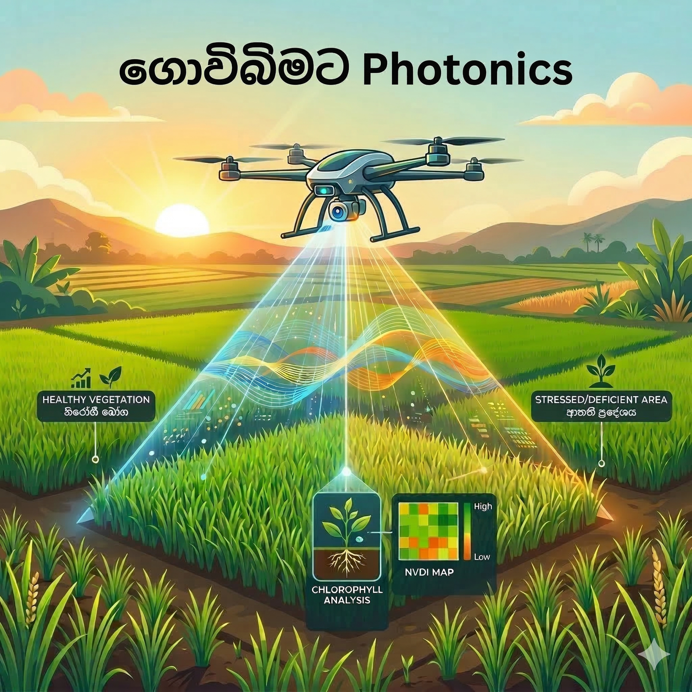
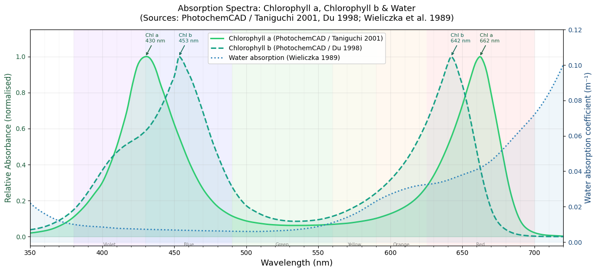
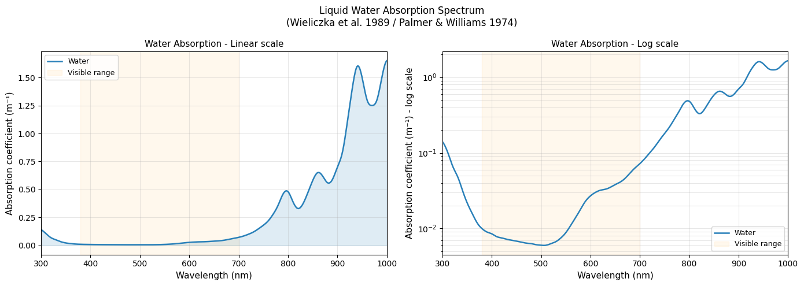
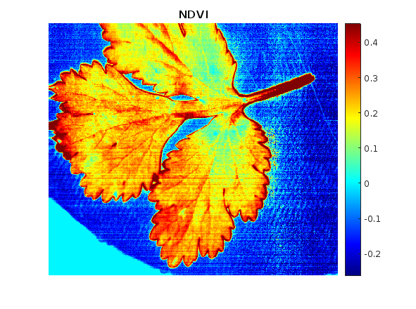
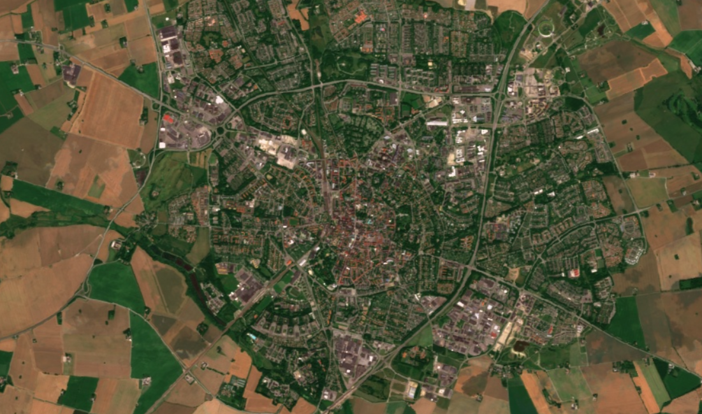
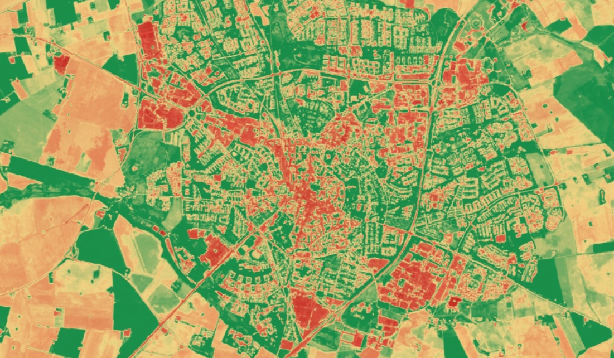
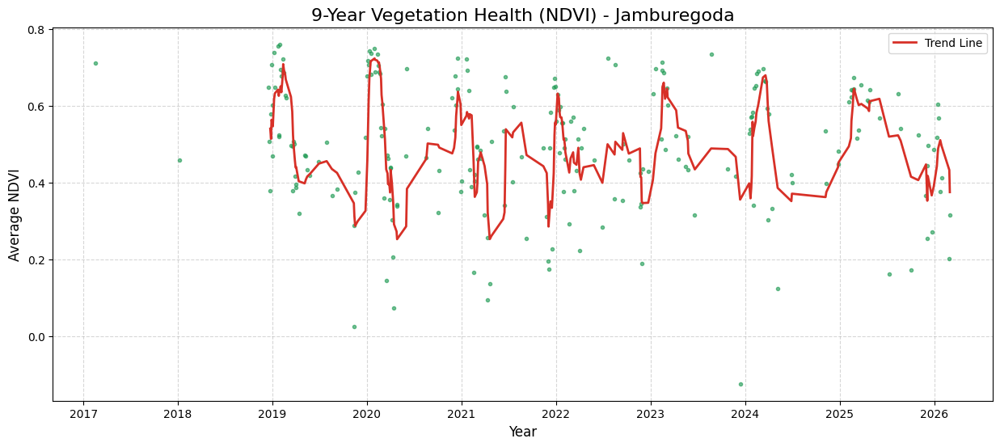
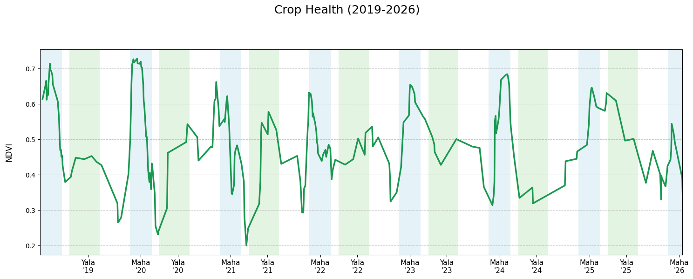

{width=50% fig-align="center"}

මේ වෙද්දි ලෝකය ආහාර සුරක්ෂිතතාවය, ආහාරවල ගුනාත්මකභාවය සහ නිෂ්පාදන වියදම් අඩු කිරීම වගේ සංකල්ප එක්ක අලුත් තාක්ෂණික ක්‍රම හොයාගෙන යන්න පටන් අරගෙන ඉවරයි. අද මගේ මාතෘකාව කෘෂිකාර්මික ක්ෂේත්‍රය ඇතුලෙ දැනටත් භාවිතා වෙන හරි අපූරු තාක්ෂණික යෙදවුම් කිහිපයක් ගැන.

මං මගේ මුල් ලිපි වල පැහැදිලි කරලා දුන්නා කොහොමද වස්තූන් වල තියෙන සමහර භෞතික රසායනික ලක්ෂන ඒවගෙ වර්ණ වලින් පේන්නෙ කියලා. මේ ලිපියෙ මං පැහැදිලි කරලා දෙනවා මොනවද ශාක වල වර්ණ වෙනස්වීම් වලින් අපිට දැනගන්න පුලුවන් තොරතුරු සහ ඒවා හරියටම හඳුනගන්න කොහොමද වර්ණාවලි පාවිච්චි කරන්නෙ කියලා.

---

## Chlorophyll වර්ණක

අපි දන්නවා ගොඩක් ශාක කොල පාටට පේන්නෙ. ඒ ඒවගෙ තියෙනෙ chlorophyll කියන වර්ණකය හින්දා. ඒ කියන්නෙ chlorophyll දෘෂ්‍ය පරාසය ඇතුලෙ කොල පාටට සාපේක්ෂව අනිත් පාට වලට අදාල ආලෝකය උරාගන්නවා කියන එක.

---

## මොකක්ද මෙයාගෙ විශේෂත්වය

ඇයි අපිට chlorophyll වැදගත් වෙන්නෙ කියලා බැලුවම, මෙයා තමයි කාබන්ඩයොක්සයිඩ් සහ ජලය පාවිච්චි කරලා ප්‍රභාසංස්ලේෂණය (photosynthesis) මගින් ග්ලූකෝස් (ආහාර) සහ ඔක්සිජන් නිෂ්පාදනය කරන්නෙ. 

එතකොට අපිට ශාකයක ආහාර නිෂ්පාදනය ගැන දැනගන්න පුලුවන් හොඳම මිම්මක් තමයි එයා තුල අඩංගු වෙලා තියෙන chlorophyll ප්‍රමාණය.

$$6CO_2 + 6H_2O \xrightarrow{\text{light, chlorophyll}} C_6H_{12}O_6 + 6O_2$$

---

## Chlorophyll වල ආලෝක අවශෝෂණය

{width=100% fig-align="center"}

මේ තමයි chlorophyll වල absorption spectra එක. අපිට මෙ දිහා බැලුවම පේනවා. මෙයා විශේෂයෙන්ම **430-450 nm** (නිල් ආලෝකය) වගේම **640-680 nm** (රතු ආලොකය) හොඳින් අවශෝෂණය කරගන්නවා.

---

## ජලයේ ආලෝක අවශෝෂණය

ජලය කියන්නෙත් ශාකයක් ඇතුලෙ සැලකිය යුතු ප්‍රමාණයක් තියෙන දෙයක්. අපි ජලයේ අවශෝෂණ වර්ණාවලිය බැලුවම දෘෂ්‍ය පරාසය ඇතුලෙ 600 nm ට වඩා වැඩි තරංග ආයාම වල අවශෝෂණය වැඩියි. ඒ වගේම Near IR (NIR) කලාපය ඇතුලෙ මේක ඉතාම වැඩි අගයක් ගන්නවා.

{width=100% fig-align="center"}

---

## එතකොට අපි දකින වර්ණයෙන් අපිට හරියටම කියන්න පුලුවන්ද chlorophyll, ජලය ගැන අදහසක්?

අපිට සාමාන්‍ය ශාකයක සහ මැරුණු ශාකයක වෙනස අපේ ඇහෙන් හඳුනගන්න පුලුවන්. ඒ කියන්නෙ chlorophyll වගේම ජලය ප්‍රමාණයේ ලොකු වෙනසක් වෙලා තියෙන ශාක. හැබැයි අපිට සියුම් වෙනස්කම් අපේ පියවි ඇහැට අඳුනගන්න අමාරුයි. ඒ වගේම හරියටම අපිට සමහර වෙලාවට හරියටම කියන්න බෑ මොන සංඝටකයෙ වෙච්ච වෙනසක් හින්දද මේ වර්ණ වෙනසක් වුනේ කියලා.

දැං අපිට කාරණා දෙකක් පැහැදිලියි:

 1. Chlorophyll වගේම ජලයට තමන්ට අනන්‍ය වුන අවශෝෂණ වර්ණාවලි තියෙනවා. ඒ වගේම වෙනත් සංඝටක වලටත් එහෙමයි.
 2. සමහර ලොකු වෙනස්කම් අඳුනගන්න පුලුවන් උනත්, සියුම් වෙනස්කම් අපේ ඇහැට හඳුනගන්න බෑ.

දැං අපේ ඉස්සරහ තියෙන ප්‍රශ්නය තමයි අපි කොහොමද මේක හරියටම අඳුනගන්නෙ කියන එක. ඒ වගේම සියුම් වෙනසක් කලින් අඳුනගන්නවා කියන්නෙ ඉක්මන් පිලියම් මගින් නැවත හොඳ තත්වයට ඒ ශාක ගන්න පුලුවන් කියන එක.

---

## තාක්ෂණික ක්‍රම

මේ වෙද්දි මේ වගේ දේවල් අඳුනගන්න විවිධ තාක්ෂණික ක්‍රම ලෝකෙට හඳුන්වලා දීලා තියෙනවා. විශේෂයෙන්ම non-destructive සහ remote sensing methods. ඒ කියන්නෙ ශාකයට කිසිම හිරිහැරයක් බාධාවක් නොකර බාහිර ඉඳන් මේ දේවල් අධ්‍යනය කරන ක්‍රම.

මම කලින් කිව්වා වගේ spectral information කියන්නෙ ඒ ඒ සංඝටක වලට හරිම අනන්‍ය ලක්ෂණ. එතකොට ඒවා හඳුනගන්න මේ වෙද්දි පාවිච්චි කරන ක්‍රම දෙකක් තමයි **Multispectral imaging** සහ **Hyperspectral imaging** කියන්නෙ.

මං කලින් ලිපියක කියලා තියෙනවා අපේ ඇස් වලින් වෙන වෙනම අඳුනගන්නෙ spectral bands 3 යි. Multispectral Imaging වලින් කරන්නෙ ඒ වෙනුවට දෘෂ්‍ය කලාපයෙ ඉඳලා අධෝරක්ත කලාපය වෙනකන් විශේෂ තරංග ආයාම කීපයක් මූලික කරගෙන spectral bands කිහිපයක් detect කරන එක. මේක හරියට මම කලින් ලිපියක කතාකරපු mantis shrimp ගෙ vision bands වගේ. ඔය පහලින් තියෙන්න multispectral imaging sytem එකක්ක bands තියෙන විදිය.

Hyperspectral imaging කියලා කියන්නෙ multi spectral imaging වලට වඩා හරිම සංවේදී ක්‍රමයක්. මෙතනදි spectral bands ඉතා විශාල ප්‍රමාණයක් අඳුනගන්නවා වෙන වෙනම. වර්ණාවලි වල සිද්ධ වෙන හරිම සියුම් වෙනස්කම් අඳුනගන්න මේවගෙන් පුලුවන්.

විශේෂයෙන් මතක් කරන්න ඕනෙ දේ තමයි Multispectral & hyperspectral imaging වලදි ලබාදෙන්නෙ එක එක bands වලට අදාල images ගොඩක්.

---

## Vegetation Indices

Multi spectral imaging ගැන කතාකරද්දි අපිට vegetation indices ගැන කතා නොකර බෑ.

### NDVI (Normalized Difference Vegetation Index)

NDVI ශාක වල vegetation එක ගැන කතා කරද්දි ඉතා බහුලව පාවිච්චි වෙන index එකක්. මෙතනදි අපිට පේනවා මෙයාගෙ අපි පාවිච්චි කරන්නෙ red & near IR bands වල values වල comparison එකක්.

$$NDVI = \frac{(NIR - Red)}{(NIR + Red)}$$

අපිට chlorophyll වල spectrum එක දිහා බැලුවම පේනවා red වල absorption ඉතා වැඩි අගයක් ගද්දි near IR වල absorption කුඩා අගයක්. අපිට ලැබෙන ආලෝකය ගැන සලකද්දි එහෙනම් red වල අඩු ආලෝකයකුත්, near IR වල වැඩි ආලෝකයකුත් ලැබෙනවා.

එහෙම බැලුවම අපි ක්ලොරොපිල් වැඩි ශාකයක් ගත්තොතින් NDVI අගය වැඩී වෙනවා. ගොඩක් අවස්ථා වල **0.8-1.0** තමයි හොඳ healthy ශාකයක NDVI අගය. **0.2-0.5** කියන්නෙ ඒ ශාකය ටිකක් stress වෙලා කියන එක. ඊට අඩු අගයක් කියන්නෙ ඒක chlorophyll අඩංගු වස්තුවක් නෙවෙයි බොහෝ විට.

මේ වගේ විවිධ indices ගනනාවක් තියෙනවා. උදාහරණයකට පහල තියෙන්නෙ **NDWI (Normalized Difference Water Index)**, ජලය ප්‍රමාණය හඳුනගන්න index එක.

$$NDWI = \frac{(Green - NIR)}{(Green + NIR)}$$

---

## කොහොමද මේ index නිරූපණය කරන්නෙ? සහ ඒකෙන් මේ තොරතුරු ලබාගන්නෙ?

මං කලින් කිව්වා වගේ multi spectral, hyperspectral imaging sytems දෙන්නෙ එක එක bands වලට අදාලව image ගොඩක්. එතකොට අපිට පුලුවන් ඒ ඒ index calculate කරලා ඒ index නිරූපණය වෙන image හදාගන්න.

පහලින් තියෙන්නෙ මම මගෙ hyperspectral imaging lab practical එකේදි ගත්තු data වලින් කරපු NDVI analysis එකක image එකක්. මේ ඇවිල්ලා ටික දවසක් කඩලා පැත්තකින් තියලා තිබුනු කොත්තමල්ලි කොලයක NDVI image එකක්.

{width=50% fig-align="center"}

---

## කොහොමද මේවා මහාපරිමාණයෙන් ගොවිබිම් වල පාවිච්චි කරන්නෙ?

මේ වෙද්දි ඩ්‍රෝන යානා වලට සම්බන්ධ කරපු multispectral camera වලින් ගන්න දත්ත එක්ක වැඩ කරන්න මහාපරිමාණ කෘෂි ව්‍යාපාර පටන් අරගෙන තියෙනවා.

මෙතනදි තියෙන වැදගත්ම කාරණාව තමයි, ශාක වලට එන්න පුලුවන් ප්‍රශ්න මුල්ම අවස්තාවෙ හඳුනාගෙන ඊට අවශ්‍ය ප්‍රතිකර්ම යොදන්න පුලුවන් එක. අනිත් කාරණාව තමයි සම්පත් කලමණාකරණය. අපි මහා පරිමාණ ගොවිබිම් ගත්තොත් ඒවට ජලය යොදන්න පොහොර යොදන්න ඉතාම ලොකු වියදමක් වෙනවා. මේ වගෙ ක්‍රම එක්ක අවශ්‍ය තැන් වලට අවශ්‍ය දේවල් ලබා දෙන්න පුලුවන්.

---

## චන්ද්‍රිකා තාක්ෂණය

::: {layout-ncol=2}

:::

මේ පින්තූරෙන් තියෙන්නෙ මං මේ වෙද්දි ඉන්න ස්විඩනයෙ Lund නගරයෙ චන්ද්‍රිකා ඡායාරූපයක් සහ ඒකට අදාල NDVI image එක. විශේෂයෙන් විශාල ගොවිබිම් වලට දැනට මේ ක්‍රමය පාවිච්චි කරනවා. මම මෙතන පාවිච්චි කරලා තියෙන්නෙ යුරෝපීය අභ්‍යාවකාශ වැඩසටහනේ, **Copernicus** කියන ව්‍යාපෘතියෙන් නොමිලේ ගන්න පුලුවන් චන්ද්‍රිකා චායාරූප දත්ත. ඇත්තටම අපිට මේක ලංකාවටත් පාවිච්චි කරන්න පුලුවන්.

මං පහල පෙන්නලා තියෙන්නෙ මගේ ගමේ (වැලිගම) ජඹුරේගොඩ වෙල් යායට කරපු පොඩි අධ්‍යනයක්. අපිට ප්‍රස්තාර එහෙම බැලුවම කන්න වෙනස වගේම ඒ ඒ කාලයෙ වී වගාවල තත්වය ගැන අවබෝධයක් ගන්න පුලුවන්. මේක මම මගේ ආසාවට කරපු සරලම අධ්‍යනයක්.

{width=50% fig-align="center"}

{width=100% fig-align="center"}
{width=100% fig-align="center"}

---

දැං අපිට පැහැදිලි වෙනවා කොහොමද අපිට කෘෂිකර්මාන්තයට මේ වගේ තාක්ෂණික ක්‍රම පාවිච්චි කරන්න පුලුවන් කියලා. මේ වෙද්දිත් ලංකාවෙ සමහර ආයතන පරික්ෂණ මට්ටමින් මේ තාක්ෂණයන් භාවිතා කරනවා. මං හිතන්නෙ කෘෂිකර්මය ගැන තීරණ ගනිද්දි මේ වගේ තාක්ෂණික යෙදවුම් හරිම වැදගත් වේවි. ඒ වගේම සම්පත් ඵලදායීව යොදවන්න අපිට මේ වගේ තාක්ෂණයක් පාවිච්චි කරන්න පුලුවන්.