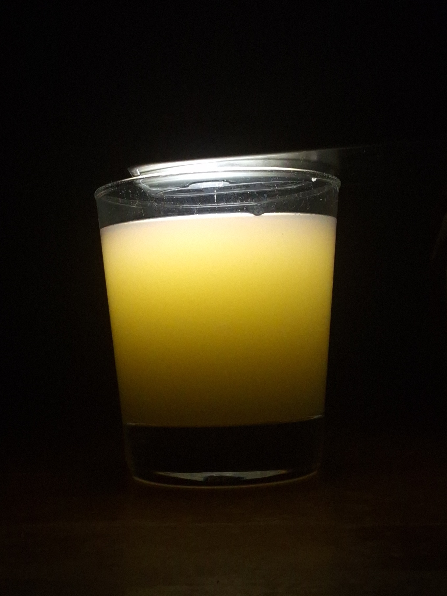
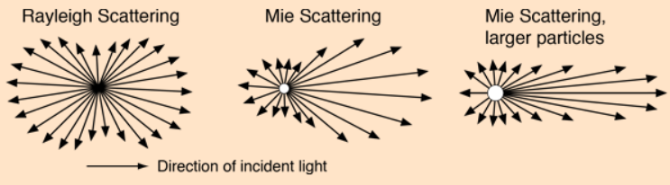
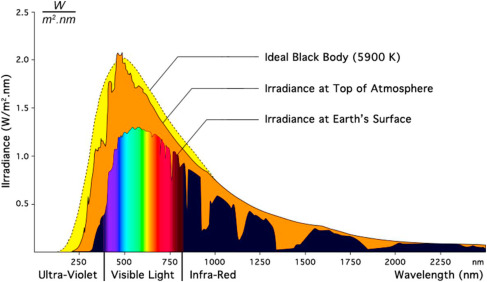

{width=50% fig-align="center"}

කවදාවත් හිතලා තියෙනවද ඇයි අහස නිල් පාට වුනේ? වලාකුළු සුදු පාට වුනේ? හවසට අහස රතු පාට වුනේ කියලා? 

අද ලිපිය ඇතුලෙ අපි ඒකට උත්තර ටික කතාකරමු. 

අපි දැකලා තියෙනවා සමහර මාධ්‍යයන් ඇතුලෙ පාවෙන අංශු, හරියට වාතයේ තියෙන දූවිලි, එහෙම නැත්නම් දියර කිරි වගේ දේවල්. මේක පාවෙන්නම ඕනෙ නැහැ. හැබැයි මේ මාධ්‍යයන් සමජාතීය නෑ. අපි මේ වගෙ මාධ්‍ය වලට කියනවා **Turbid medium** කියලා. සිංහලෙන් "බොර වුන" වගේ අදහසක් තමා එන්නෙ. 

මේ වගෙ මාධ්‍යයන් ඇතුලෙ ආලෝකය ගමන් කරද්දි හරි අපූරු වැඩක් වෙනවා. ඒ තමයි එක කෙලින් මාර්ගයක යනවා වෙනුවට හැරි හැරි ගමන් කරන එක. අපි මේකට කියනවා **Light scattering (ප්‍රකීරණය)** කියලා. 

මෙහෙම හැරි හැරි යන්නෙ පරාවර්තනය නිසා නෙවෙයි. මේකට හේතු වෙන්නෙ මේ විෂමජාතීය (inhomogeneous) මාධ්‍යය ආලෝකයත් එක්ක සිද්ධවෙන interaction එක. 

---

අපි හැමදාම දකින දෙයක් එක්ක අපි මේ ගැන හිතල බලමු...

පහල තියෙන්නෙ කිරි වීදුරුවක්. මං මේකට ඉහලින් පොඩි direct flashight එකක් ගහලා තියෙනව. අපි දන්නවා මේ වගේ වෙලාවට ආලෝකය යන්නෙ එක සරල රේඛීය මාර්ගයක කියලා. එහෙම නම් මේක කොහොමද මගෙ කැමරාවට පෙනුනෙ. ඉහලින් ආලෝකය එල්ල කරත් වීදුරුව ඇතුලෙ තියෙන කිරි අංශු හරහා ආලෝකය ගමන් කරද්දි හැරුන හින්දා තමයි කිරි වීදුරුවෙන් කැමරාවට ආලෝකය ලැබිලා තියෙන්නෙ.

{width=30% fig-align="center"}

### මොන මොන හේතු මතද මේ ආලෝකය හැරීම බලපාන්නෙ 

මේකට මේ මාධ්‍යයෙ සහ පැමිණෙන ආලෝකයෙ තියෙන ගුනාංග ගොඩක් බලපානවා. අදාල මාධ්‍යය තුල වර්තනාංක වෙනස, මාධ්‍යය ඇතුලෙ තියෙන විශමජාතීය අංශු ප්‍රමාණය, ඒ අංශු වල අරය සහ පැමිණෙන ආලෝකයෙ wavelength එක වගේ දේවල් තමයි ප්‍රධාන කරුණු. 

### අංශු වල ප්‍රමාණය (size එක) මොන විදියටද මේකට බලපාන්නෙ?
මෙතනදි අපි මේ size එක Compare කරන්න ඕනෙ ආලෝකයෙ wavelength එක එක්ක. 

#### Particle size << wavelength: 
මේ අවස්තාවට කියන්නෙ **Rayleigh scattering** කියලා. අපිට rayleigh scattering වල ගණිතමය සම්බන්ධය පහල තියෙන equation එකෙන් පෙන්නන්න පුලුවන්. 

$$I = I_0 \frac{8\pi^4 N \alpha^2}{\lambda^4 R^2} (1 + \cos^2\theta)$$

* $\alpha$: Polarizability
* $R$: Distance to the particle
* $\theta$: Scattering angle

සාමාන්‍යයෙන් අපිට කියන්න පුලුවන් මෙතන ආලෝකයේ විසිරීම හැම දිශාවකටම තියෙනවා කියලා. හැබැයි විසිරෙන දිශාවත් එක්කත් මෙතන සම්බන්ධයක් තියෙනව. මෙතනදි බැලුවම අඩු wavelength ($\lambda$) එකක් විසිරී යනවා වැඩියි. විශේෂයෙන්ම නිල් සහ දම් වගෙ වර්ණ. ඒ වගෙම රතු වල විසිරීම අඩුයි. 

#### Particle size $\gtrsim$ wavelength 
මෙතැනදී සිදුවෙන Scattering phenomenon එකට අපි කියනව **Mie scattering** කියලා. මේකෙ ගණිතමය මොඩලය නම් ටිකක් සංකීර්ණයි. සමස්ථයක් විදියට මේකෙදි ආලෝකය ඉදිරි දිශාවට (**forward direction**) විසරණය කරනවා. 

{width=80%}

---

### ඇයි දවල් අහස නිල් වෙලා වලාකුළු සුදු පාට වුනේ??? 

අපි දන්නවා වායුගෝලයෙ බහුතර ප්‍රමාණයක් තියෙන්නෙ නයිට්‍රජන් වායුව , ඊලඟට ඔක්සිජන් වායුව. මේ අණු දෘෂ්‍ය ආලෝකයේ තරංග ආයාමයට සාපේක්ෂව කුඩායි. එතකොට මෙතනදි සිද්ධවෙන්නෙ Rayleigh scattering. 

අපි කලින් දැකපු විදියට තරංග ආයාමය කුඩා වෙද්දි Scattering වෙන ආලෝකයෙ Intensity එක වැඩි වෙනවා. නිල් සහ දම් වල මේ විසිරීම ඉතා වැඩියි. රතු වගේ තරංග ආයාමය වැඩි ආලෝකය විසිරීම ඉතා අඩුයි. ඒවා බොහො වෙලාවට ඉදිරි දිශාවට තමයි එන්නෙ. අර විසිරිලා ගිය නිල් ආලෝකය තමයි අපෙ ඇහැට නිල් අහසක් විදියට පේන්නෙ. 

* **එතකොට දම්??** එකක් දම් ආලෝකටට අපේ ඇහැ සංවේදී අඩුයි. අනික තමා සූර්‍ය වර්ණාවලියෙ දම් ආලෝකයෙ intensity එක අඩුයි. 
* **එතකොට ඇයි අපිට රතු පේන්නෙ නැත්තෙ??** මං කලින් කිව්වා වගෙ රතු ආලෝකය ඉදිරි දිශාවට ආවත් එයා එන්නෙ තනියා නෙවෙයි. අනිත් වර්ණත් එක්කමයි. එතකොට අපිට පේන ඉරේ සුදු ආලෝකය ඇතුලෙම තමා ඒ රතුත් තියෙන්නෙ. 

{width=80% fig-align="center"}

### වලාකුළු සුදු පාට වුනේ ඇයි? 
මේකට හේතුව mie scattering. වලාකුළු වල තියෙන්නෙ ටිකක් විශාලත්වයෙන් වැඩි ජල බිඳිති. මෙතනදි දෘෂ්‍ය පරාසයෙ තියෙන ආලෝකය ඉදිරි දිශාවට යනවා වඩා වැඩියෙන්. හැම තරංග ආයාමයම ඒ විදියට වෙනවා කියන්නෙ, අපිට වලාකුළු පේන්න ඕනෙ සුදු පාටින් තමයි. මීදුමත් මේ වගේම තමයි. 

---

### ඇයි එතකොට හවස අහස රතු පාට වුනේ? 

මෙතනදි අපිට කියන්න පුලුවන් mie scattering කියලා. හැබැයි ඒ එක්කම තව කාරණා කීපයක්ම සම්බන්ධ කරන්න වෙනවා. 

හවස ඉරෙන් ලැබෙන ආලෝකය ගැන සැලකුවම, ආලෝකය වායුගෝලය දිගේ වැඩි දුරක් ගමන් කරනවා. ඒ වගේම වායුගෝලයෙ තියෙන්නෙ වායු අණු විතරක්ම නෙවෙයි. කුඩා ප්‍රමාණයෙ දූවිලි, ජල වාෂ්ප එහෙමත් තියෙනවා. එතකොට කොහොමත් mie scattering තමා apply වෙන්නෙ. ඒ කියන්නෙ ආලෝකට ඉදිරි දිශාවට scatter වෙන්නෙ. 

මේ ඉදිරියට යන ආලෝකය වායුගෝලය මගින් අවශෝෂණය කරගන්නවා. හැබැයි රතු ආලෝකය අවශෝෂණය කරගන්න ප්‍රමාණය ඉතාම අඩුයි (**absorption coefficient** එක අඩුයි.) ඒ කියන්න රතු ආලෝකයට වැඩි දුරක් කිසි ප්‍රශ්නයක් නැතුව ඔහොම යන්න පුලුවන්. ඒ රතු ආලෝකය තමයි අපි දකින්නෙ. 

**ඉතින් දවල් අහසෙත් ඕක වෙන්නෙ නැද්ද??** වෙනවා. හැබැයි එතකොට ආලෝකය වැඩි දුරක් ගමන් කරන්නෙ නැති හින්දා මේ අවශෝෂණයෙන් ලොකු බලපෑමක් නෑ. 

මේ තමයි අපේ අහසෙ පාට මැවෙන කතන්දරේ.